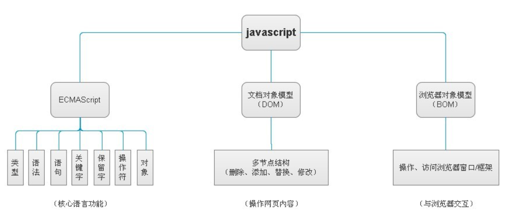

# JavaScript 基础

JavaScript 是一门编程语言，可为网站添加交互功能（例如：游戏、动态样式、动画以及在按下按钮或收到表单数据时做出的响应等）。

## JavaScript 的组成



1. ECMASCRIPT: 定义了 javascript 的语法规范,描述了语言的基本语法和数据类型
2. BOM (Browser Object Model): 浏览器对象模型

- 有一套成熟的可以操作浏览器的 API，通过 BOM 可以操作浏览器。比如： 弹出框、浏览器跳转、获取分辨率等

3. DOM (Document Object Model): 文档对象模型

- 有一套成熟的可以操作页面元素的 API，通过 DOM 可以操作页面中的元素。比如： 增加个 div，减少个 div，给 div 换个位置等

## JavaScript 能干什么

1. 常见的网页效果 [表单验证，轮播图。。。]
2. 与 H5 配合实现游戏 [水果忍者： http://www.jq22.com/demo/html5-fruit-ninja/]
3. 实现应用级别的程序 [http://naotu.baidu.com]
4. 实现图表统计效果 [https://echarts.apache.org/examples/zh/]
5. js 可以实现人工智能 [面部识别]
6. 后端开发，app 开发，桌面端开发......

## JavaScript 代码的书写位置

- 和 `css` 一样，我们的 `js` 也可以有多种方式书写在页面上让其生效
- `js` 也有多种方式书写，分为 **行内式**， **内嵌式**，**外链式**

## JavaScript 变量

- 变量指的是在程序中保存数据的一个容器
- 变量是计算机内存中存储数据的标识符，根据变量名称可以获取到内存中存储的数据
- 也就是说，我们向内存中存储了一个数据，然后要给这个数据起一个名字，为了是我们以后再次找到他
- 语法： `var 变量名 = 值`

### 数据类型

**基本数据类型**

1. 数值类型（number）
   - 一切数字都是数值类型（包括二进制，十进制，十六进制等）
   - `NaN`（not a number），一个非数字
2. 字符串类型（string）
   - 被引号包裹的所有内容（可以是单引号也可以是双引号）
3. 布尔类型（boolean）
   - 只有两个（`true` 或者 `false`）
4. null 类型（null）
   - 只有一个，就是 `null`，表示空的意思
5. undefined 类型（undefined）
   - 只有一个，就是 `undefined`，表示没有值的意思

## JavaScript 运算符

### 数学运算符

1. `+`

   > 只有符号两边都是数字的时候才会进行加法运算
   >
   > 只要符号任意一边是字符串类型，就会进行字符串拼接

2. `-`

   > 会执行减法运算
   >
   > 会自动把两边都转换成数字进行运算

3. `*`

   > 会执行乘法运算
   >
   > 会自动把两边都转换成数字进行运算

4. `/`

   > 会执行除法运算
   >
   > 会自动把两边都转换成数字进行运算

5. `%`

   > 会执行取余运算
   >
   > 会自动把两边都转换成数字进行运算

### 赋值运算符

1. `=`

   > 就是把 `=` 右边的赋值给等号左边的变量名
   >
   > `var num = 100`
   >
   > 就是把 100 赋值给 num 变量
   >
   > 那么 num 变量的值就是 100

2. `+=`

   > ```js
   > var a = 10
   > a += 10
   > console.log(a) //=> 20
   > ```
   >
   > `a += 10` 等价于 `a = a + 10`

3. `-=`

   > var a = 10;
   >
   > ```js
   > a -= 10
   > console.log(a) //=> 0
   > ```
   >
   > `a -= 10` 等价于 `a = a - 10`

4. `*=`

   > ```js
   > var a = 10
   > a *= 10
   > console.log(a) //=> 100
   > ```
   >
   > `a *= 10` 等价于 `a = a * 10`

5. `/+`

   > ```js
   > var a = 10
   > a /= 10
   > console.log(a) //=> 1
   > ```
   >
   > `a /= 10` 等价于 `a = a / 10`

6. `%=`

   > ```js
   > var a = 10
   > a %= 10
   > console.log(a) //=> 0
   > ```
   >
   > `a %= 10` 等价于 `a = a % 10`

### 逻辑运算符

1. `&&`

   - 进行 且 的运算
     > 符号左边必须为 `true` 并且右边也是 `true`，才会返回 `true`
     >
     > 只要有一边不是 `true`，那么就会返回 `false`
     >
     > `true && true` 结果是 `true`
     >
     > `true && false` 结果是 `false`
     >
     > `false && true` 结果是 `false`
     >
     > `false && false` 结果是 `false`

2. `||`

   - 进行 或 的运算
     > 符号的左边为 `true` 或者右边为 `true`，都会返回 `true`
     >
     > 只有两边都是 `false` 的时候才会返回 `false`
     >
     > `true || true` 结果是 `true`
     >
     > `true || false` 结果是 `true`
     >
     > `false || true` 结果是 `true`
     >
     > `false || false` 结果是 `false`

3. `!`

   - 进行 取反 运算
     > 本身是 `true` 的，会变成 `false`
     >
     > 本身是 `false` 的，会变成 `true`
     >
     > `!true` 结果是 `false`
     >
     > `!false` 结果是 `true`

## JavaScript 分支结构

- 我们的 `js` 代码都是顺序执行的（从上到下）
- 逻辑分支就是根据我们设定好的条件来决定要不要执行某些代码

### IF 条件分支结构

**if 语句**

- 通过一个 `if` 语句来决定代码是否执行

- 语法： `if (条件) { 要执行的代码 }`

- 通过 `()` 里面的条件是否成立来决定 `{}` 里面的代码是否执行

  ```js
  // 条件为 true 的时候执行 {} 里面的代码
  if (true) {
    alert('因为条件是 true，我会执行')
  }

  // 条件为 false 的时候不执行 {} 里面的代码
  if (false) {
    alert('因为条件是 false，我不会执行')
  }
  ```

**if else 语句**

- 通过 `if` 条件来决定，执行哪一个 `{}` 里面的代码

- 语法： `if (条件) { 条件为 true 的时候执行 } else { 条件为 false 的时候执行 }`

- 两个 `{}` 内的代码一定有一个会执行

  ```js
  // 条件为 true 的时候，会执行 if 后面的 {}
  if (true) {
    alert('因为条件是 true，我会执行')
  } else {
    alert('因为条件是 true，我不会执行')
  }

  // 条件为 false 的时候，会执行 else 后面的 {}
  if (false) {
    alert('因为条件为 false，我不会执行')
  } else {
    alert('因为条件为 false，我会执行')
  }
  ```

  ### 循环结构

  - 循环结构，就是根据某些给出的条件，重复的执行同一段代码

- 循环必须要有某些固定的内容组成
  1. 初始化
  2. 条件判断
  3. 要执行的代码
  4. 自身改变

**WHILE 循环**

- `while`，中文叫 当…时，其实就是当条件满足时就执行代码，一旦不满足了就不执行了

- 语法 `while (条件) { 满足条件就执行 }`

- 因为满足条件就执行，所以我们写的时候一定要注意，就是设定一个边界值，不然就一直循环下去了

  ```javascript
  // 1. 初始化条件
  var num = 0
  // 2. 条件判断
  while (num < 10) {
    // 3. 要执行的代码
    console.log('当前的 num 的值是 ' + num)
    // 4. 自身改变
    num = num + 1
  }
  ```

  - 如果没有自身改变，那么就会一直循环不停了

  **FOR 循环**

- 和 `while` 和 `do while` 循环都不太一样的一种循环结构

- 道理是和其他两种一样的，都是循环执行代码的

- 语法： `for (var i = 0; i < 10; i++) { 要执行的代码 }`

  ```javascript
  // 把初始化，条件判断，自身改变，写在了一起
  for (var i = 1; i <= 10; i++) {
    // 这里写的是要执行的代码
    console.log(i)
  }

  // 控制台会依次输出 1 ~ 10
  ```

- 这个只是看起来不太舒服，但是用起来比较好用
