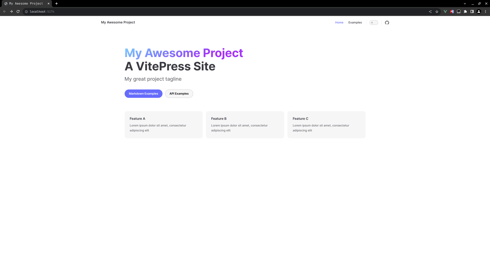

# 搭建个人网站

搭建网站的技术有很多，本文以使用vitepress静态网站生成器为例，介绍从生成网站到发布的过程

## 网站构建

[VitePress](https://vitepress.dev/)是一个静态网站生成器（SSG），专为构建快速、以内容为中心的网站而设计。
简而言之，VitePress 获取您用Markdown编写的源内容，对其应用主题，并生成可以轻松部署到任何地方的静态 HTML 页面。

### 安装vitepress

在安装之前，你需要保证以下条件：

- nodejs的版本要求为16或以上
- 通过命令行接口访问VitePress的终端
- 支持Markdown语法的文本编辑器（官方推荐使用VSCode）

`本文以在linux mint 20操作系统，和以Webstorm为开发环境为例`

在某个目录下新建一个名称为`my-vitepress`文件夹，然后右键在终端中打开，输入 `npm init`，可以根据提示输入名称，
也可以回车到底结束引导。随后会创建一个`package.json`文件，接着在终端中输入`npm install -D vitepress`，作用是将
vitepress安装到开发环境的依赖中。接着在终端中输入`npx vitepress init`，输入后会直接进入vitepress初始引导界面


完成引导操作后，vitepress便构建完成

### 文件结构

假设您选择在引导中按照上图所选，生成的文件结构应如下所示：

```
.
├─ docs
│  ├─ .vitepress
│  │   ├─ theme
│  │   │   ├─ index.ts                              -----------项目主题配置文件
│  │   │   └─ style.css                             -----------项目主题样式文件
│  │   └─ config.ts                                 -----------项目配置文件
│  ├─ api-examples.md                               -----------单页面md文件
│  ├─ markdown-examples.md                          -----------单页面md文件
│  └─ index.md                                      -----------首页md文件
└─ package.json
```

### 项目启动

在编辑器中打开package.json文件

```
{
  ...
  "scripts": {
    "docs:dev": "vitepress dev docs",
    "docs:build": "vitepress build docs",
    "docs:preview": "vitepress preview docs"
  },
  ...
}
```

在终端中输入`npm run docs:dev`，在本地开发服务器启动项目，项目初始预览如下：



[更多开发文档说明请参考VitePress官网](https://vitepress.dev/guide/what-is-vitepress)

## 项目发布

假设你已经使用 vitepress 开发出了让自己满意的网站，接下来就可以试着将自己的网站发布到线上环境。
本文以腾讯云轻量应用服务器，安装镜像为 Ubuntu20.04LTS 64bit 为例。

### 打包项目

在你开发完成自己的网站时，可以使用`npm run docs:build`命令进行项目打包，在.vitepress文件夹下
的dist文件就是打包后的项目。你也可以使用`npm run docs:preview`来预览打包后的项目是否符合预期。

### 登录云服务器

腾讯云轻量应用服务器有很多登录方式，这里以 SSH 密钥登录为例。登录腾讯云控制台选择自己的服务器


选择绑定秘钥后，可以选择创建新密钥和绑定已有公钥。本文选择绑定已有公钥，将本地的公钥放到上面即可，
如果本地没有公钥，可以使用以下命令生成:

```shell
ssh-keygen -t rsa -b 4096 -C "your_email@example.com"
```

将本地生成的id_rsa.pub文件中的内容放到已有公钥上即可。

密钥绑定完成后，打开终端输入以下命令: 其中`username`为服务器的登录用户名，`IP_HOST`为服务器公网IP

```shell
ssh <username>@IP_HOST
```

初次登陆需要在提示内容中输入 yes ，将服务器的 ip 添加到本地

### 安装nginx服务器

连接到云服务器后，需要在服务器上安装 nginx 服务器，输入以下命令安装：

```shell
sudo apt update
sudo apt install nginx
```

安装过程中会提示是否继续，输入y继续安装。

完成安装后，使用以下命令启动 nginx 服务器：

```shell
sudo systemctl start nginx
```

验证 nginx 是否已成功启动。使用以下命令执行：

```shell
sudo systemctl status nginx
```

如果状态显示为 "active (running)"，则表示 Nginx 已经成功安装并正在运行。

在浏览器中输入服务器的 IP 地址，如果能够显示 nginx 的默认欢迎页面，说明安装成功。


### 上传文件

nginx 安装成功后，需要将本地打包的 dist 文件上传到云服务器，上传有scp,ftp等方式，
这里以scp为例，新建终端并输入以下命令：

```shell
scp -r /path/local/file username@remote_ip:/path/remote/directory
```

- `/path/to/local/file`：本地文件的路径和名称。
- `username`：远程服务器的用户名。
- `remote_ip`：远程服务器的 IP 地址或域名。
- `/path/to/remote/directory`：远程服务器上目标目录的路径。如果希望将文件上传到用户的主目录下，
- 可以省略路径部分。

### 修改 nginx 配置

nginx 的配置文件通常位于 `/etc/nginx` 目录下，连接远程服务器后，使用以下命令进入 `/etc/nginx`
目录下并编辑 `nginx.conf` 文件：

```shell
cd ../../etc/nginx
sudo nano nginx.conf
```

在 `nginx.conf` 文件中的 http 下添加以下内容：

```
    server {
        listen       80;
        server_name  localhost;

        location / {
           root   /var/www/dist;
           try_files $uri $uri/ /index.html;
           index  index.html;
        }
    }
```

- `listen` : 表示监听的端口号
- `server_name` : 表示监听的地址
- `root` : 为上传至服务器的打包项目的文件地址
- `try_files` : 尝试按照给定顺序查找文件。如果请求的文件存在，则直接返回文件内容。如果请求的文
  件不存在，则将请求重定向到 /index.html
- `index` : 指定默认的索引文件为 index.html

需要将 `nginx.conf` 文件中的以下内容注释：

```
#	include /etc/nginx/conf.d/*.conf;
#	include /etc/nginx/sites-enabled/*;
```

::: tip
需要注意 80 端口的配置是否与 nginx 的默认配置有冲突
:::

更改 `nginx` 配置后，需要在终端中输入以下命令来重新加载 `nginx` 配置 ：

```shell
sudo nginx -s reload
```

至此，在浏览器中输入你的服务器的公网 IP ，应该就能看到你的网站了！

### DNS 域名解析

使用 IP 访问对用户来说是并不友好的，这也是域名出现的原因。在域名提供商（阿里云，腾讯云等）
购买你想要的域名，并将其绑定至你的云服务器上，就可以通过域名访问你的网站了。

## 自动部署

文章前部分介绍过将项目打包上传至服务器。但对网站来说，可能需要更新维护，每次重复打包上
传的动作显得费力且无意义。这时便体现了自动部署的优点。

### GitHub Action 自动部署

当你的项目是存放在github上时，GitHub Actions 是一种持续集成和持续交付 (CI/CD) 平台，
可用于自动执行生成、测试和部署管道。 您可以创建工作流程来构建和测试存储库的每个拉取请求，
或将合并的拉取请求部署到生产环境。

在你\项目中选择Actions，你可以在Marketplace中选择一个模板，它会自动在项目根目录下创建
`.github/workflows/main.yml`文件（文件名随意）。也可以在根目录下自行创建。


在上传到服务器的过程中，我们会用到服务器的相关信息，此时不能直接写在配置文件中，
会暴露我们的信息，这时就可以将将服务器的信息配置在 Actions secrets，在文件中
使用即可。


`yml`文件内容如下：
```yml
#工作流的名称
name: build and deploy

#触发工作流的事件
on:
  push:
    branches: [ "master" ]

jobs:
  build-and-deploy:
    #运行在Ubuntu最新版的镜像上运行
    runs-on: ubuntu-latest

    steps:
        #检查并拉取代码
      - name: Checkout
        uses: actions/checkout@v3
        
        #设置环境为nodejs 18
      - name: Use Node.js 18
        uses: actions/setup-node@v3
        with:
          node-version: '18.x'
          
        #安装模块并打包项目 
      - name: Build Project
        run: |
          npm install
          npm run build
        
        #将文件上传至云服务器  
      - name: ssh-scp-deploy
        uses: marcodallasanta/ssh-scp-deploy@v1.2.0
        with:
          #本地打包后的文件目录
          local: docs/.vitepress/dist
          #上传至远程服务器的目标目录
          remote: /home/ubuntu/
          #远程服务器的地址
          host: ${{ secrets.REMOTE_HOST }}
          #远程服务器的用户名
          user: ${{ secrets.REMOTE_USERNAME }}
          #远程服务器的密钥（与密码二者选其一）
          key: ${{ secrets.PRIVATE_KEY }}
          #上传后执行的脚本
          post_upload: sudo nginx -s reload
```

配置好自动部署后，以后我们每次合并代码到 master 分支时，都会帮我们自动上传到云服务器，
并重启nginx服务


